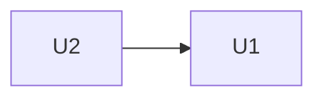

# Unidades de trabajo

> Descomposición del sistema en unidades construibles y probables de forma
> independiente. El bloque JSON al final es la fuente que usa el workflow
> para ordenar la construcción: mantenlo sincronizado con las tablas.

## Resumen

| ID | Directorio | Nombre | Tipo | Complejidad | Depende de |
|---|---|---|---|---|---|
| U1 | u1-<nombre> | <nombre> | service | M | — |
| U2 | u2-<nombre> | <nombre> | ui | S | U1 |

Tipos: `service` (ejecutable desplegado), `ui` (interfaz), `library`
(código reutilizable sin runtime propio), `spec` (contrato/esquema),
`packaging` (build/distribución).

## Detalle por unidad

### U1 — <nombre>
- **Responsabilidad:** <qué posee y entrega>
- **Componentes incluidos:** <de application-design>
- **Historias:** <US1.1, US1.2>
- **Despliegue:** <independiente | compartido | embebido>
- **Notas de implementación:** <restricciones, riesgos>

## Dependencias



<Puntos de integración entre unidades: APIs, datos compartidos, eventos.>

## Definición para el workflow

```json
{
  "units": [
    { "id": "u1-nombre", "name": "U1 — Nombre", "kind": "service", "depends_on": [] },
    { "id": "u2-nombre", "name": "U2 — Nombre", "kind": "ui", "depends_on": ["u1-nombre"] }
  ]
}
```
