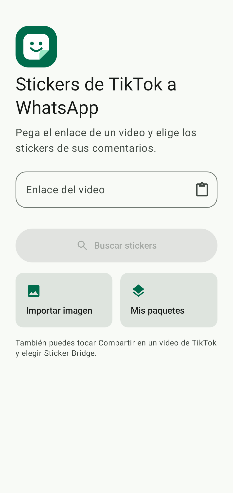
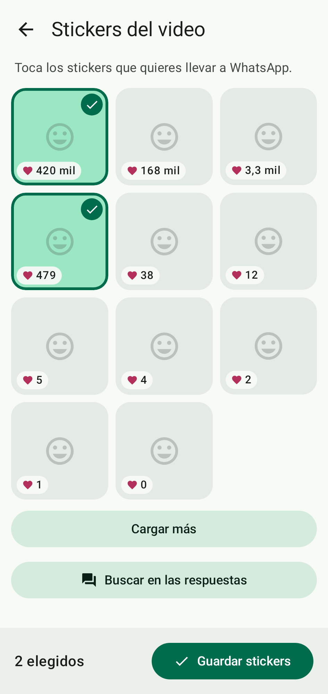
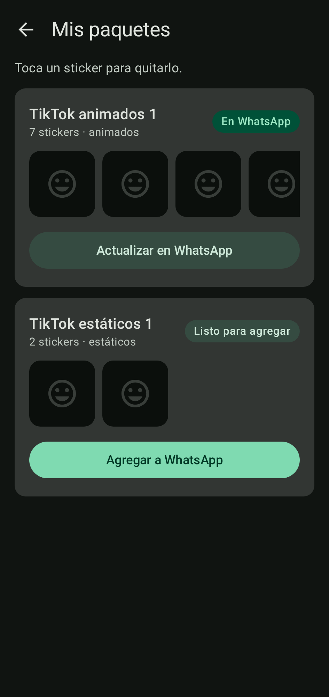

# Sticker Bridge

Personal Android app that turns the stickers used in TikTok comments into WhatsApp
stickers: share a TikTok video to the app, pick the images from its comments, and they
land in WhatsApp as a sticker pack — converted automatically, animation kept when it fits.
Stickers posted as replies to comments can be fetched on demand.

> **Personal and educational project.** TikTok offers no official API for comments. This
> app reads the public post page in a hidden in-app browser, which goes against TikTok's
> terms of service and may stop working whenever TikTok changes its site. It never asks
> for or stores a TikTok login, and it sends no data to any server of its own. It is not
> published on Google Play.

## Screens

| Paste a link | Choose stickers | Your packs |
|---|---|---|
|  |  |  |

These images are rendered on the computer from the app's own screens with placeholder
stickers, by `./gradlew :app:updateDebugScreenshotTest`.

## Status

Under construction, unit by unit:

| Unit | Content | Status |
|---|---|---|
| U1 | Walking skeleton: link → extraction → static sticker → pack → WhatsApp | Done |
| U3 | Animated stickers | Done |
| U2 | Robust extraction: load more, order by likes, error types | Done |
| U4 | Pack series, full-pack split, remove stickers, save use case | Done |
| U5 | Final screens: choose each sticker, Share target, gallery import | Code written; on-device check in progress |

## Architecture

Ports and adapters over two Gradle modules:

- **`core`** — pure Kotlin, no Android: link and response parsing, conversion rules, pack
  rules and validation. It declares interfaces (ports) for everything external.
- **`app`** — Android: the WebView extractor, WebP encoding, file storage, the
  `ContentProvider` WhatsApp reads, and the Compose UI. It implements the ports.

The TikTok extraction lives behind one port (`CommentImageExtractor`), so it can be
replaced without touching selection, conversion or packs. Design documents and
decisions (ADRs) are in [`aidlc-docs/`](aidlc-docs/).

## Requirements

- JDK 17 or newer
- Android SDK with platform 36 and build-tools (Android Studio, or the command-line
  tools with `ANDROID_HOME` set)
- An Android 8.0+ phone with USB debugging enabled, for installing and checking

## Commands

On Windows use `gradlew.bat` instead of `./gradlew`.

| Action | Command |
|---|---|
| Tests | `./gradlew test` (core only: `./gradlew :core:test`, no Android SDK needed) |
| Lint and format | `./gradlew ktlintCheck detekt :app:lintDebug` · fix formatting: `./gradlew ktlintFormat` |
| Build the APK | `./gradlew :app:assembleDebug` |
| Install on the phone | `./gradlew :app:installDebug` |
| Render the screens to images | `./gradlew :app:updateDebugScreenshotTest` (check them: `:app:validateDebugScreenshotTest`) |
| Diagnostic log | `adb logcat -s StickerBridge` |

The on-device checks are in [`docs/manual-checklist.md`](docs/manual-checklist.md), the release
build in [`docs/release.md`](docs/release.md) and the privacy policy in
[`docs/privacy-policy.md`](docs/privacy-policy.md).

## Tech stack

Kotlin 2.4 · Jetpack Compose (Material 3) · Coroutines · AndroidX WebKit · OkHttp ·
kotlinx.serialization · JUnit 5 · ktlint · detekt. Minimum Android 8.0 (API 26).
