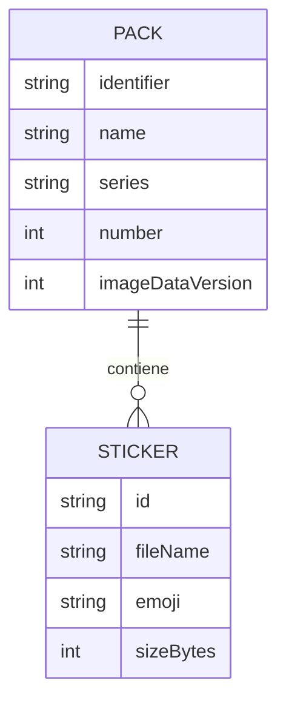
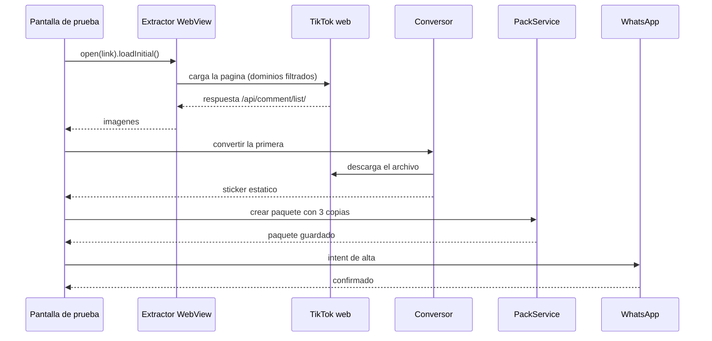

# Diseño funcional — U1 — Esqueleto funcional

Qué hace exactamente el esqueleto: el proyecto base y una rebanada mínima que
recorre todo el sistema (enlace → extracción en el teléfono → conversión
estática → paquete → WhatsApp), con los puertos ya en su forma definitiva. Su
fin es demostrar que las piezas conectan y responder tres dudas abiertas
antes de construir el resto.

## Alcance de la unidad

Historias: ninguna completa; prueba la viabilidad de US2.1, US3.1, US4.1 y
US4.2 · Requisitos ejercitados (en versión mínima): FR2.1, FR2.7, FR4.1,
FR4.2, FR4.3, FR4.7, FR5.3, FR5.5, FR5.6, FR5.7 · NFR4, NFR6, NFR7, NFR8.

Preguntas que el esqueleto debe responder, con evidencia anotada en la
comprobación manual:

| ID | Pregunta | Cómo se responde |
|---|---|---|
| Q-SK1 | ¿Se obtienen las imágenes de los comentarios sin iniciar sesión, con el navegador interno oculto y el bloqueo de dominios activo? (RSK-01, NFR6) | Con 3 videos reales: número de imágenes obtenidas y dominios bloqueados registrados |
| Q-SK2 | ¿WhatsApp muestra un sticker añadido a un paquete ya agregado, sin volver a agregarlo, al aumentar `imageDataVersion`? (FR5.6) | Botón "Añadir otro" tras agregar el paquete; mirar WhatsApp |
| Q-SK3 | ¿Cuánto tarda cada tramo: primera tanda, conversión estática? (NFR1, NFR2) | Tiempos en el registro de depuración |

Fuera de esta unidad: animados, cargar más, errores detallados, varias
series, reparto al llenarse, cuadrícula, Compartir, importación. Se construyen
en U2 a U5.

## Modelo de datos

Índice de paquetes (`packs.json`, almacenamiento interno), esquema versión 1.
Es el formato definitivo (ADR-004); U1 solo escribe un paquete estático.

```json
{
  "schemaVersion": 1,
  "packs": [
    {
      "identifier": "tiktok_static_1",
      "name": "TikTok estáticos 1",
      "publisher": "TikTok Stickers",
      "series": "STATIC",
      "number": 1,
      "imageDataVersion": 1,
      "trayIconFile": "tray.png",
      "stickers": [
        { "id": "a1b2c3", "fileName": "a1b2c3.webp", "emoji": "😀", "sizeBytes": 48211 }
      ]
    }
  ]
}
```

| Campo | Tipo | Restricciones |
|---|---|---|
| `identifier` | texto | Único; ≤ 128; solo letras, números, `_`, `-`, `.` (BR-15) |
| `name`, `publisher` | texto | ≤ 128 |
| `series` | `STATIC` o `ANIMATED` | Un solo tipo por paquete (BR-12) |
| `number` | entero ≥ 1 | Único por serie |
| `imageDataVersion` | entero ≥ 1 | Solo aumenta (BR-17) |
| `trayIconFile` | texto | PNG 96×96 ≤ 50 KB dentro de la carpeta del paquete |
| `stickers` | lista ordenada, 0–30 | `fileName` único dentro del paquete |

Archivos: `files/packs/<identifier>/<fileName>` y
`files/packs/<identifier>/tray.png`. Sin migraciones (primera versión).



## Lógica de negocio

### OP-1 — Extraer la primera imagen de una publicación

- **Precondiciones:** hay conexión; el texto introducido contiene un enlace de
  publicación (en U1 se acepta tal cual, sin validar formas: eso es U2).
- **Pasos:**
  1. La interfaz pide al puerto `CommentImageExtractor` abrir una sesión para
     el enlace y llama `loadInitial()`.
  2. El adaptador crea un WebView oculto con agente de usuario de escritorio,
     JavaScript activo y sin interacción del usuario (FR2.7).
  3. Antes de cargar la página, registra un script de inicio de documento que
     envuelve `fetch` y `XMLHttpRequest`: cuando la dirección contiene
     `/api/comment/list/`, envía el texto de la respuesta a la app por un
     canal de mensajes restringido al origen `https://www.tiktok.com`.
  4. Cada petición del WebView pasa por `HostAllowlist.isAllowed(host)` (BR-05);
     las no permitidas se bloquean y se registran en el diagnóstico.
  5. Cada respuesta recibida se lee con `CommentResponseParser`: de cada
     comentario se toman las direcciones de `image_list`, y se eliminan
     duplicados por dirección (BR-02).
  6. En U1 la carga termina con la primera respuesta que traiga al menos una
     imagen, o a los 30 s (BR-04).
  7. Al terminar (bien, mal o por cancelación) se cierra la sesión: se destruye
     el WebView y se borran cookies y almacenamiento web (NFR4).
- **Postcondiciones:** una `ExtractionPage` con imágenes, o un
  `ExtractionError`.

### OP-2 — Convertir una imagen a sticker estático

- **Pasos:** descargar con OkHttp (tiempo límite 15 s); decodificar el primer
  cuadro; calcular el encaje con `FitCalculator` (BR-06); dibujar en un lienzo
  transparente de 512×512; codificar WebP bajando la calidad por pasos de
  BR-07 hasta ≤ 100 KB.
- **Postcondiciones:** archivo temporal válido o `ConversionError`.

### OP-3 — Crear el paquete de prueba y ofrecerlo a WhatsApp

- **Pasos:** con el sticker de OP-2, `PackService` crea "TikTok estáticos 1"
  si no existe y añade el sticker tres veces como archivos distintos (para
  llegar al mínimo de 3); genera el ícono (BR-15); asigna 😀 (BR-16); valida
  (BR-19); el repositorio guarda de forma atómica (BR-21). Si WhatsApp no
  tiene el paquete, la interfaz lanza el intent de alta.
- **Postcondiciones:** paquete persistido y servido por el `ContentProvider`.

### OP-4 — Añadir otro sticker al paquete ya agregado

- **Pasos:** añade una copia más del mismo sticker, aumenta
  `imageDataVersion` (BR-17), guarda y avisa a WhatsApp con
  `StickerPackPublisher.notifyChanged`.
- **Postcondiciones:** el paquete tiene un sticker más; se comprueba a mano si
  WhatsApp lo muestra (Q-SK2).

## Interfaces

### Puertos de `core` (forma definitiva, de `interfaces.md`)

```kotlin
interface CommentImageExtractor { fun open(link: PostLink): ExtractionSession }
interface ExtractionSession : AutoCloseable {
    suspend fun loadInitial(): ExtractionOutcome   // Page or Error
    suspend fun loadMore(): ExtractionOutcome      // U1: returns Error(UnexpectedFormat) - not implemented until U2
}
interface ImageSource { suspend fun open(ref: ImageRef): ImageOutcome }
interface StickerEncoder {
    suspend fun encodeStatic(frame: Frame, plan: ConversionPlan, quality: Int): EncodedFile
    suspend fun encodeAnimated(frames: FrameSequence, plan: ConversionPlan, quality: Int, fps: Int): EncodedFile // U3
    suspend fun encodeTrayIcon(stickerFile: FileRef): EncodedFile
}
interface PackRepository { suspend fun load(): List<StickerPack>; suspend fun commit(changes: PackChanges) }
interface StickerPackPublisher {
    fun isWhatsAppInstalled(): Boolean
    suspend fun isAdded(identifier: String): Boolean
    fun notifyChanged(pack: StickerPack)
}
interface DiagnosticLog { fun event(tag: String, message: String, cause: Throwable? = null) }
```

`Frame`, `FrameSequence`, `FileRef` e `ImageRef` son tipos de `core` que no
exponen clases de Android; los adaptadores convierten.

### Pantalla de prueba (provisional, la sustituye U5)

| Elemento | Comportamiento |
|---|---|
| Campo "Enlace del video" | Texto libre |
| Botón "Probar" | Ejecuta OP-1 → OP-2 → OP-3; muestra cada paso y su tiempo |
| Botón "Añadir otro" | Ejecuta OP-4; visible si el paquete existe |
| Texto de estado | Paso actual, tiempos, número de imágenes, error si lo hay |

### `ContentProvider` para WhatsApp

Las cuatro consultas de `interfaces.md` (`metadata`, `metadata/<id>`,
`stickers/<id>`, `stickers_asset/<id>/<archivo>`), protegido por el permiso
de lectura de WhatsApp; declaración de consulta de los paquetes `com.whatsapp`
para la visibilidad de paquetes.

## Validaciones y errores

| Caso | Condición | Respuesta |
|---|---|---|
| Sin imágenes en 30 s | No llega ninguna respuesta con imágenes | "No se encontraron imágenes (30 s)"; se registra si hubo respuestas sin imágenes |
| Respuesta ilegible | El JSON no tiene `comments` | `UnexpectedFormat`; se registra un extracto sin datos personales |
| Página pide sesión | Se detecta redirección a la página de inicio de sesión | `CommentsBlocked` |
| Descarga falla | Error de red o código distinto de 200 | `DownloadFailed` |
| No cabe en 100 KB | Ni con calidad 10 | `TooLarge` |
| WhatsApp ausente | No está instalado | "WhatsApp no está instalado"; el paquete se guarda |
| Paquete inválido | `PackValidator` encuentra incumplimientos | No se ofrece a WhatsApp; se muestran los incumplimientos |

## Flujos principales



## Casos de prueba derivados

Automáticos (JVM, `core`):

1. `CommentResponseParser` obtiene las direcciones de `image_list` de una
   respuesta de ejemplo con comentarios con y sin imagen.
2. `CommentResponseParser` devuelve `UnexpectedFormat` sin `comments`.
3. `CommentResponseParser` elimina direcciones repetidas (BR-02).
4. `HostAllowlist` permite `www.tiktok.com` y subdominios de la red de archivos
   de TikTok, y rechaza otros (BR-05).
5. `FitCalculator`: 300×600 → 256×512 en (128, 0); 100×100 → 512×512; 800×400
   → 512×256 en (0, 128) (BR-06).
6. Pasos de calidad estática: con un codificador falso, se detiene en el
   primer paso ≤ 100 KB y devuelve `TooLarge` si ninguno cabe (BR-07).
7. `PackService` crea "TikTok estáticos 1" con identificador
   `tiktok_static_1`, autor fijo y emoji 😀 (BR-15, BR-16).
8. Añadir un sticker aumenta `imageDataVersion` (BR-17).
9. `PackValidator` rechaza un paquete con 2 stickers y acepta uno con 3
   (BR-19).
10. Si el repositorio falla al guardar, el estado cargado sigue siendo el
    anterior (BR-21, con repositorio falso).

Adaptadores (JVM con archivos temporales):

11. El repositorio de archivos escribe y vuelve a leer el índice; un archivo
    temporal sobrante no aparece al cargar.

Manuales (teléfono): Q-SK1, Q-SK2, Q-SK3 de la sección de alcance.

## Trazabilidad

| Historia / FR | Sección |
|---|---|
| US2.1 · FR2.1, FR2.7 · NFR4, NFR6 | OP-1, casos 1–4, Q-SK1 |
| US3.1 · FR4.1–FR4.3 | OP-2, casos 5–6 |
| US4.1 · FR4.7, FR5.3, FR5.5, FR5.7 | OP-3, casos 7, 9–11 |
| US4.2 · FR5.6 | OP-4, caso 8, Q-SK2 |
| NFR1, NFR2 | Q-SK3 |
| NFR7, NFR8 | `ContentProvider` y permisos |

## Supuestos

- [assumption] Con agente de usuario de escritorio, la página de un video
  carga sus comentarios sin abrir ningún panel. Si no, el adaptador simula
  abrir el panel de comentarios; se decide en el esqueleto.
- [assumption] La respuesta de comentarios tiene `comments[].image_list[]`
  con listas de direcciones, según scrapers de terceros. El esqueleto guarda
  una respuesta real anonimizada como ejemplo para las pruebas.
- [assumption] La descarga del archivo de imagen funciona con la cabecera
  `Referer: https://www.tiktok.com/`.
