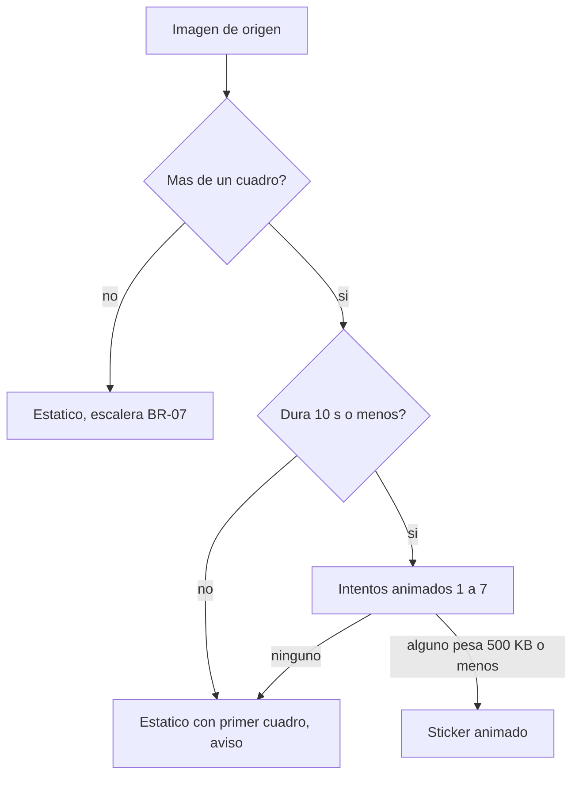

# Diseño funcional — U3 — Conversión a sticker

Qué hace exactamente la conversión completa: cualquier imagen (estática o WebP
animado, remota o de la galería) se convierte en un sticker válido de WhatsApp,
conservando la animación cuando cabe en los límites y cayendo a estático con
aviso cuando no. Se apoya en los puertos y la conversión estática de U1.

## Alcance de la unidad

Historias: US3.1, US3.2 · Requisitos: FR4.1–FR4.6, FR7.2 (misma conversión para
la galería) · Reglas: BR-06 a BR-11 · NFR2, NFR3, NFR17.

Fuera: elegir varias imágenes, resumen y paquetes por serie (U4); pantallas (U5).

## Hallazgos del esqueleto que condicionan el diseño

- Los stickers de TikTok llegan como WebP animado (`.awebp`) de 498×498 en
  `cmt_sticker_struct.animated_url`; las fotos, como JPEG en `image_list`.
- La conversión estática de U1 tarda 1,1 s y produce ~28 KB.
- Formatos de origen soportados: WebP (estático o animado), JPEG y PNG. GIF no
  aparece en los comentarios de TikTok y queda fuera [assumption].

## Modelo de datos

Cambia un tipo de `core` y se añaden dos:

| Tipo | Campos | Notas |
|---|---|---|
| `SourceImageInfo` | `width`, `height`, `frameDurationsMs: List<Long>` | `frameCount` y `totalDurationMs` pasan a ser derivados. Una imagen estática tiene un cuadro de duración 0 |
| `SampledFrame` | `sourceIndex: Int`, `durationMs: Long` | Un cuadro del sticker de salida: qué cuadro de origen muestra y cuánto dura |
| `AnimatedAttempt` | `quality: Int`, `maxFps: Int?` | Un intento de codificación animada; `maxFps` nulo = cadencia original |

Sin persistencia nueva.

## Lógica de negocio

### OP-1 — Decidir el tipo de salida (BR-08, BR-10)

- Un origen es **candidato a animado** si tiene más de un cuadro y dura 10 s o
  menos.
- Si tiene más de un cuadro y dura más de 10 s: se convierte como estático con su
  primer cuadro y `animationDropped = true`.
- Un origen de un solo cuadro sigue el camino estático de U1 (BR-07),
  `animationDropped = false`.

### OP-2 — Muestreo de cuadros (`FrameSampler`, BR-09)

- **Cadencia original:** cada cuadro de origen se conserva con su duración; un
  cuadro de menos de 8 ms se funde con el siguiente (o con el anterior si es el
  último), de modo que ninguno dura menos de 8 ms y la duración total se
  mantiene.
- **Cadencia limitada a N cuadros por segundo:** se recorre la línea de tiempo en
  pasos de `1000 / N` ms y en cada paso se toma el cuadro de origen visible en
  ese instante; cuadros consecutivos iguales se funden. El último cuadro dura
  hasta completar la duración total exacta.
- Si la cadencia original ya es menor o igual que N, limitar a N no cambia nada y
  ese intento se omite.

### OP-3 — Escalera de intentos animados (`AnimatedQualityLadder`, BR-09)

Sustituye a la escalera de 18 combinaciones que describía el modelo de dominio
(calidad 80…30 en cada cadencia), demasiado lenta para NFR2. Los intentos, en
orden, hasta el primero que pese 500 KB o menos:

| # | Calidad | Cadencia |
|---|---|---|
| 1 | 75 | original |
| 2 | 50 | original |
| 3 | 30 | original |
| 4 | 50 | máx. 15 fps |
| 5 | 30 | máx. 15 fps |
| 6 | 40 | máx. 10 fps |
| 7 | 30 | máx. 10 fps |

Cada intento rechazado se descarta (borra su archivo, NFR17). Si ninguno cabe:
caída a estático con el primer cuadro (BR-10), `animationDropped = true`, serie
estática (BR-11). Nunca se acorta la duración ni se acelera.

### OP-4 — Presupuesto de memoria al decodificar

Los cuadros decodificados se guardan ya escalados al encaje de 512 (BR-06). Si
`ancho × alto × 4 × cuadros` supera 96 MB, se decodifican solo los cuadros que
deja una cadencia limitada que quepa en el presupuesto (mismo `FrameSampler`). El
cálculo vive en `core` (`FrameBudget`).

### OP-5 — Reconocer un WebP animado (`WebpSniffer`)

A partir de los primeros bytes: `RIFF....WEBP` seguido de un bloque `VP8X` con el
indicador de animación activo. Todo lo demás se decodifica como imagen estática.

## Interfaces

### Puerto `StickerEncoder` (se amplía)

```kotlin
suspend fun encodeAnimated(
    image: DecodedImage,
    placement: Placement,
    frames: List<SampledFrame>,
    quality: Int,
): EncodedFile
```

### `StickerConverter.convert(ref)` (misma firma)

Aplica OP-1 a OP-3 y devuelve `ConversionResult.Converted` con la serie
`ANIMATED` o `STATIC` y `animationDropped`, o `Failed`.

### Adaptadores de `app`

| Clase | Cambio |
|---|---|
| `BitmapImageSource` | Si `WebpSniffer` detecta animación: escribe el archivo temporal, decodifica cuadros con `WebPDecoder` (librería `webp-android`), los escala al encaje y aplica el presupuesto de OP-4. Si no, `BitmapFactory` como en U1 |
| `AnimatedDecodedImage` | Nuevo: lista de cuadros escalados y sus duraciones |
| `WebpStickerEncoder` | `encodeAnimated` con `WebPAnimEncoder` (con pérdida, bucle infinito, fondo transparente); `encodeStatic` acepta también imágenes animadas (primer cuadro) |

## Validaciones y errores

| Caso | Condición | Respuesta |
|---|---|---|
| Animación demasiado larga | Más de 10 s | Estático con aviso (`animationDropped`) |
| Animación demasiado pesada | Ningún intento ≤ 500 KB | Estático con aviso |
| Ni el estático cabe | Calidad 10 > 100 KB | `TooLarge` |
| WebP animado ilegible | El decodificador falla | `UnsupportedImage` |
| Origen con demasiados cuadros | Supera el presupuesto de memoria | Se decodifica a cadencia reducida (OP-4) |

## Flujos principales



En texto: una imagen de un cuadro va al estático; una animada de más de 10 s, al
estático con aviso; una animada corta prueba los 7 intentos y, si ninguno cabe,
cae al estático con aviso.

## Casos de prueba derivados

Automáticos (`core`):

1. `WebpSniffer`: reconoce un WebP animado (bandera de animación en `VP8X`), y
   trata como no animados un WebP simple, un JPEG y datos cortos.
2. `FrameSampler` original: conserva duraciones; funde un cuadro de 5 ms; la suma
   se mantiene.
3. `FrameSampler` limitado: 30 cuadros de 33 ms a 10 fps dan cuadros de 100 ms y
   la suma se mantiene (990 ms).
4. `FrameSampler` limitado con cadencia original menor: devuelve la original.
5. `FrameBudget`: 498×498 con 300 cuadros supera el presupuesto y propone una
   cadencia que cabe.
6. Conversor: animación corta cuyo primer intento cabe → animado, serie
   `ANIMATED`, calidad 75, cadencia original.
7. Conversor: solo cabe el intento 6 → se probaron 1 a 6 y se descartaron 1 a 5.
8. Conversor: ningún intento cabe → estático, `animationDropped`, serie `STATIC`,
   intentos animados descartados.
9. Conversor: animación de 12 s → estático con aviso sin intentos animados.
10. Conversor: imagen de un cuadro → estático sin aviso (regresión de U1).

Manuales (teléfono): un sticker animado real sigue animado en WhatsApp; uno largo
o pesado llega estático con aviso; tiempos de conversión.

## Trazabilidad

| Historia / FR | Sección |
|---|---|
| US3.1 · FR4.1, FR4.2, FR4.3, FR4.6 | OP-1 (camino estático), casos 1, 10 |
| US3.2 · FR4.4 | OP-2, OP-3, casos 2–4, 6, 7 |
| US3.2 · FR4.5 · BR-11 | OP-1, OP-3, casos 8, 9 |
| FR7.2 | Mismo conversor para `ImageRef.Local` |
| NFR2, NFR17 | OP-3 (máx. 7 intentos, descarte), OP-4 |

## Supuestos

- [assumption] `WebPDecoder.decodeNextFrame()` devuelve cuadros ya compuestos y la
  marca de tiempo de fin de cada cuadro (convención de libwebp); la duración de un
  cuadro es la diferencia con la marca anterior. Se comprueba en el teléfono.
- [assumption] 7 intentos caben en el presupuesto de NFR2 (< 6 s) para stickers de
  TikTok típicos (≤ 3 s, ~500×500). Se mide en el teléfono.
- [assumption] GIF no aparece como origen.
