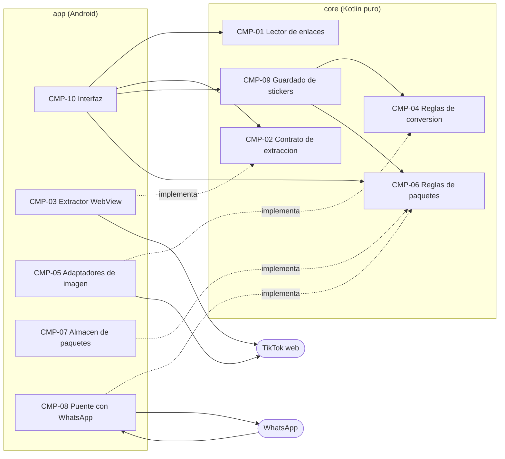
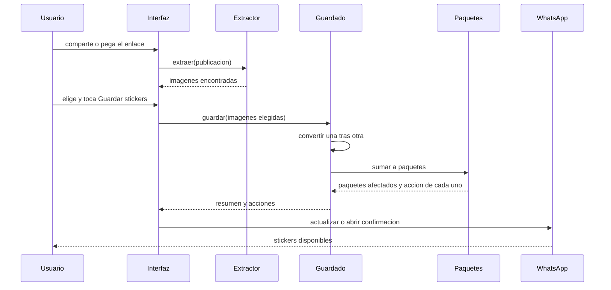

# Componentes

Los bloques de la app, qué hace cada uno, qué datos posee y de qué depende.
El estilo es puertos y adaptadores (ADR-005): el módulo `core` contiene las
reglas y declara interfaces (puertos) para todo lo externo; el módulo `app`
las implementa con Android, TikTok, WhatsApp y libwebp (adaptadores).

## Tabla de componentes

| ID | Componente | Módulo / paquete | Responsabilidad | Entidades que posee | Expone | Depende de |
|---|---|---|---|---|---|---|
| CMP-01 | Lector de enlaces | `core/link` | Encontrar un enlace de publicación de TikTok dentro de un texto y clasificarlo | `PostLink` | `PostLinkParser` | — |
| CMP-02 | Contrato y lectura de extracción | `core/extraction` | Definir el puerto de extracción, sus resultados y errores; leer el JSON de comentarios y obtener las imágenes; decidir cuándo termina la carga inicial; lista de dominios permitidos | `CommentImage`, `ExtractionPage`, `ExtractionError` | Puerto `CommentImageExtractor`, `CommentResponseParser`, `InitialLoadPolicy`, `HostAllowlist` | — |
| CMP-03 | Extractor con navegador interno | `app/extraction` | Cargar la publicación en un WebView oculto, capturar las respuestas de comentarios, pedir más, bloquear dominios ajenos, borrar datos al terminar | — | Implementación de `CommentImageExtractor` | CMP-02, CMP-11 |
| CMP-04 | Reglas de conversión | `core/conversion` | Calcular el encaje a 512, los pasos de calidad y de cuadros, cuándo un origen puede ser animado y cuándo cae a estático; orquestar la conversión de una imagen | `SourceImageInfo`, `ConversionPlan`, `ConvertedSticker` | `StickerConverter`; puertos `ImageSource`, `StickerEncoder` | — |
| CMP-05 | Adaptadores de imagen | `app/conversion` | Descargar una imagen desde su dirección o leerla de la galería; decodificar cuadros; codificar WebP estático y animado; generar el ícono | — | Implementaciones de `ImageSource` y `StickerEncoder` | CMP-04, CMP-11 |
| CMP-06 | Reglas de paquetes | `core/pack` | Series, alta de stickers, reparto al llenarse, nombres e identificadores, versión, validación contra los límites de WhatsApp, estado de cada paquete | `StickerPack`, `Sticker`, `PackSeries`, `PackStatus` | `PackService`; puertos `PackRepository`, `StickerPackPublisher` | — |
| CMP-07 | Almacén de paquetes | `app/pack/storage` | Guardar archivos de stickers e íconos y el índice JSON con escritura atómica; limpiar archivos huérfanos | Archivos e índice | Implementación de `PackRepository` | CMP-06 |
| CMP-08 | Puente con WhatsApp | `app/pack/whatsapp` | Servir paquetes y archivos a WhatsApp (`ContentProvider`), preguntar si un paquete está agregado, abrir la confirmación de alta, saber si WhatsApp está instalado | — | Implementación de `StickerPackPublisher`; `StickerContentProvider` | CMP-06, CMP-07 |
| CMP-09 | Guardado de stickers | `core/save` | Caso de uso principal: convertir en serie las imágenes elegidas, sumarlas a sus paquetes y determinar qué hacer con cada paquete afectado; producir el resumen | `SaveResult`, `PackAction` | `SaveStickersUseCase` | CMP-04, CMP-06 |
| CMP-10 | Interfaz | `app/ui` | Pantallas (entrada, búsqueda y cuadrícula, resultado, paquetes), ViewModels, recepción del intent Compartir, selector de galería, textos en español | Estado de pantalla | Actividad y pantallas Compose | CMP-01, CMP-02, CMP-06, CMP-09 |
| CMP-11 | Diagnóstico | `core/diagnostics` + `app/di` | Puerto de registro y su adaptador sobre el registro de Android; contenedor que arma las dependencias | — | Puerto `DiagnosticLog`; `AppContainer` | — |

## Diagrama

Versión en texto:

- La interfaz (CMP-10) usa el lector de enlaces (CMP-01), el puerto de
  extracción (CMP-02), el guardado (CMP-09) y las reglas de paquetes (CMP-06).
- El guardado (CMP-09) usa las reglas de conversión (CMP-04) y de paquetes
  (CMP-06).
- Los adaptadores de `app` implementan puertos de `core`: CMP-03 el de
  extracción; CMP-05 los de imagen; CMP-07 y CMP-08 los de paquetes.
- Solo CMP-03 y CMP-05 hablan con TikTok; solo CMP-08 habla con WhatsApp, y
  WhatsApp lee de CMP-08.

## Flujo principal

## Por qué estos límites

- **Lo que cambia por causas ajenas queda solo.** TikTok (CMP-03), la librería
  de imágenes (CMP-05) y WhatsApp (CMP-08) pueden cambiar sin aviso; cada uno
  está tras un puerto y se sustituye sin tocar reglas ni pantallas (NFR11,
  regla "extracción siempre aislada").
- **Las reglas son comprobables sin teléfono.** Enlaces, lectura de
  respuestas, encaje y pasos de conversión, y todas las reglas de paquetes
  están en `core` y se prueban primero, como pide la postura de pruebas.
- **Un solo dueño por dato.** Los paquetes pertenecen a CMP-06; CMP-07 solo los
  persiste y CMP-08 solo los publica. El estado "agregado a WhatsApp" no se
  guarda: se pregunta a WhatsApp (ADR-006).
- **El caso de uso de guardado (CMP-09) es el único punto que coordina**
  conversión y paquetes, de modo que extracción e importación manual comparten
  exactamente el mismo camino (FR7.2).

## Trazabilidad

| Requisitos | Historias | Componentes |
|---|---|---|
| FR1.1 | US1.1 | CMP-10, CMP-01 |
| FR1.2 | US1.2 | CMP-10, CMP-01 |
| FR1.3, FR1.4 | US1.1, US1.2, US1.3 | CMP-01, CMP-10 |
| FR2.1, FR2.6, FR2.7 | US2.1 | CMP-03, CMP-02 |
| FR2.2 | US2.1 | CMP-02 (política), CMP-03 |
| FR2.3 | US2.1 | CMP-10, CMP-03 |
| FR2.4 | US2.3 | CMP-03, CMP-10 |
| FR2.5 | US2.1 | CMP-02 |
| FR3.1 – FR3.4 | US2.1, US2.2, US2.4 | CMP-10 |
| FR4.1 – FR4.5 | US3.1, US3.2 | CMP-04, CMP-05 |
| FR4.6 | US3.1 | CMP-09, CMP-10 |
| FR4.7 | US3.1 | CMP-06 |
| FR4.8 | US3.3 | CMP-09, CMP-05 |
| FR5.1 – FR5.4 | US4.1, US4.3 | CMP-06, CMP-07 |
| FR5.5, FR5.6 | US4.1, US4.2 | CMP-09, CMP-06, CMP-08, CMP-10 |
| FR5.7 | US4.4 | CMP-07, CMP-08 |
| FR5.8 | US4.4 | CMP-10, CMP-06, CMP-08 |
| FR5.9 | US3.3 | CMP-09, CMP-10 |
| FR5.10 | US4.5 | CMP-08, CMP-10 |
| FR6.1 – FR6.4 | US5.1 | CMP-02, CMP-03, CMP-10 |
| FR7.1 – FR7.3 | US5.2 | CMP-10, CMP-05, CMP-09 |
| NFR4, NFR6 | US2.1 | CMP-03, CMP-02 |
| NFR8 | — | CMP-08 |
| NFR9, NFR10 | — | CMP-06, CMP-07 |
| NFR11, NFR12 | US6.1 | CMP-02, CMP-11 |
