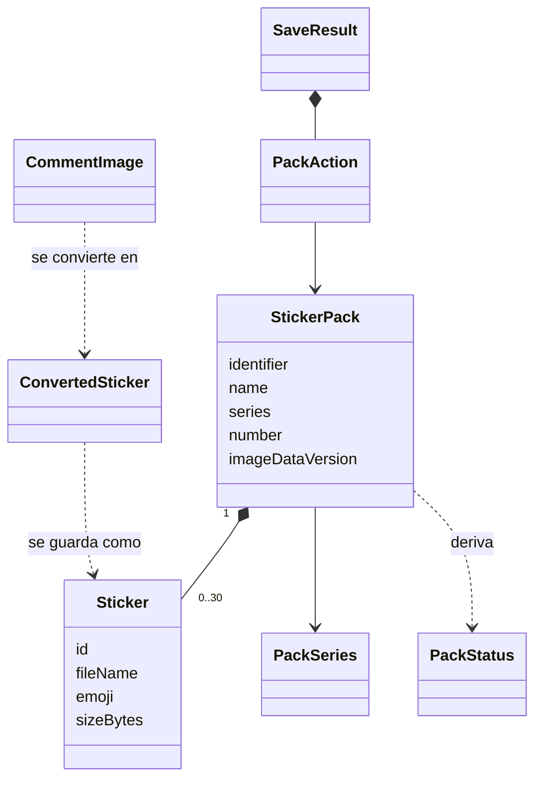

# Modelo de dominio

Las entidades y valores con los que trabaja la app, a qué componente
pertenecen, cómo se relacionan y las reglas de negocio (`BR-0n`) que deben
cumplirse siempre. Los nombres están en inglés porque serán identificadores
de código.

## Entidades y valores

| Nombre | Tipo | Componente dueño | Atributos clave |
|---|---|---|---|
| `PostLink` | Valor | CMP-01 | `url` normalizada; `kind`: LONG_VIDEO, LONG_PHOTO, MOBILE, SHORT |
| `CommentImage` | Valor | CMP-02 | `url` del archivo original (identidad); `thumbnailUrl`; `animatedHint` (si TikTok lo indica) |
| `ExtractionPage` | Valor | CMP-02 | `images` nuevas de la tanda; `hasMore` |
| `ExtractionError` | Valor (tipos cerrados) | CMP-02 | `NoConnection`, `PostUnavailable`, `CommentsBlocked`, `Timeout`, `UnexpectedFormat(detail)` |
| `SourceImageInfo` | Valor | CMP-04 | `width`, `height`, `frameCount`, `totalDurationMs` |
| `ConversionPlan` | Valor | CMP-04 | `targetWidth`, `targetHeight`, `offsetX`, `offsetY`; `output`: STATIC o ANIMATED; pasos de calidad y de cuadros por segundo a intentar |
| `ConvertedSticker` | Valor | CMP-04 | `file` temporal, `series`, `sizeBytes`, `animationDropped` |
| `PackSeries` | Enumeración | CMP-06 | ANIMATED, STATIC |
| `Sticker` | Entidad | CMP-06 | `id`, `fileName`, `emoji`, `sizeBytes` |
| `StickerPack` | Entidad (raíz) | CMP-06 | `identifier`, `name`, `publisher`, `series`, `number`, `stickers` (ordenados), `trayIconFile`, `imageDataVersion` |
| `PackStatus` | Valor derivado | CMP-06 | `NeedsMore(missing)`, `ReadyToAdd`, `Added` |
| `PackAction` | Valor | CMP-09 | `Updated(pack)`, `RequestAdd(pack)`, `Waiting(pack, missing)` |
| `SaveResult` | Valor | CMP-09 | `saved` por paquete, `withoutAnimation`, `failed`, `actions`, `whatsAppInstalled` |

## Relaciones

En texto: un paquete contiene de 0 a 30 stickers y pertenece a una serie; su
estado se deriva, no se guarda. Una imagen de comentario se convierte en un
sticker convertido, que al guardarse pasa a ser un sticker de un paquete. El
resultado de guardar lleva una acción por cada paquete afectado.

## Reglas de negocio

| ID | Regla | Requisitos | Dueño |
|---|---|---|---|
| BR-01 | Un enlace es válido solo si corresponde a una de las seis formas de publicación de TikTok; se extrae aunque esté dentro de un texto | FR1.3, FR1.4 | CMP-01 |
| BR-02 | Las imágenes se identifican por la dirección de su archivo original; una misma dirección aparece una sola vez por búsqueda | FR2.5 | CMP-02 |
| BR-03 | La carga inicial termina tras 3 tandas o 10 s contados desde la primera tanda, lo que ocurra primero | FR2.2 | CMP-02 |
| BR-04 | Si la primera tanda no llega en 30 s desde el inicio, la extracción termina con `Timeout` | FR6.3 | CMP-02 |
| BR-05 | El navegador interno solo puede pedir recursos de dominios de la lista permitida | NFR6 | CMP-02 |
| BR-06 | Encaje: se escala (ampliando o reduciendo) hasta que el lado mayor mida 512, conservando proporción; se centra en un lienzo transparente de 512×512 | FR4.1, FR4.2 | CMP-04 |
| BR-07 | Estático: se reduce la calidad por pasos (90, 80, 70, 60, 50, 40, 30, 20, 10) hasta pesar 100 KB o menos; si ni con 10 cabe, la imagen falla | FR4.3, FR4.8 | CMP-04 |
| BR-08 | Un origen es candidato a animado si tiene más de un cuadro y dura 10 s o menos | FR4.4, FR4.5 | CMP-04 |
| BR-09 | Animado: se reduce primero la calidad (80, 70, 60, 50, 40, 30) y después los cuadros por segundo (hasta 15 y luego 10, manteniendo la duración total) hasta pesar 500 KB o menos; ningún cuadro dura menos de 8 ms; no se acorta ni acelera | FR4.4 | CMP-04 |
| BR-10 | Si un candidato a animado no cumple tras agotar BR-09, o dura más de 10 s, se convierte como estático con su primer cuadro y se marca `animationDropped` | FR4.5 | CMP-04 |
| BR-11 | La serie de un sticker es la de su resultado: `animationDropped` va a STATIC | FR5.1 | CMP-06 |
| BR-12 | Un paquete contiene stickers de una sola serie y como máximo 30 | FR5.1, FR5.2 | CMP-06 |
| BR-13 | Cada serie tiene un paquete abierto: el de mayor número. Un sticker nuevo va al paquete abierto de su serie; si no existe, se crea con número 1 | FR5.1 | CMP-06 |
| BR-14 | Si el paquete abierto tiene 30, se crea el siguiente con los 2 últimos stickers del lleno más el nuevo; el lleno queda con 28 | FR5.2 | CMP-06 |
| BR-15 | Nombre "TikTok animados N" / "TikTok estáticos N"; identificador `tiktok_animated_N` / `tiktok_static_N`; autor "TikTok Stickers"; ícono de 96×96 del primer sticker, regenerado si ese sticker cambia | FR5.3 | CMP-06 |
| BR-16 | Todo sticker lleva el emoji 😀 | FR4.7 | CMP-06 |
| BR-17 | `imageDataVersion` aumenta en cada cambio de contenido del paquete (alta, reparto, ícono) | FR5.6 | CMP-06 |
| BR-18 | Estado: menos de 3 stickers → `NeedsMore(3 − n)`; 3 o más y WhatsApp dice que no está agregado → `ReadyToAdd`; WhatsApp dice que sí → `Added` | FR5.4, FR5.8 | CMP-06 |
| BR-19 | Un paquete solo se ofrece a WhatsApp si pasa la validación completa de límites | NFR10 | CMP-06 |
| BR-20 | Acción tras guardar por paquete afectado: `Added` → `Updated`; `ReadyToAdd` → `RequestAdd`; `NeedsMore` → `Waiting` | FR5.5 | CMP-09 |
| BR-21 | Alta y reparto son atómicos: el índice se reemplaza una sola vez, después de escribir los archivos; un fallo antes deja el estado anterior intacto | NFR9 | CMP-06, CMP-07 |
| BR-22 | Una imagen que falla al descargar o convertir no detiene a las demás; se cuenta en `failed` | FR4.8 | CMP-09 |
| BR-23 | Las imágenes se convierten una tras otra | NFR1, NFR3 | CMP-09 |

## Invariantes

- Ningún paquete persistido tiene más de 30 stickers ni mezcla series.
- Dentro de una serie, solo el paquete de mayor número puede tener menos de
  28 stickers.
- Todo archivo referenciado por el índice existe; lo no referenciado no forma
  parte de ningún paquete.
- `imageDataVersion` nunca disminuye.

## Supuestos

- [assumption] Los pasos de calidad y de cuadros de BR-07 y BR-09 son un punto
  de partida; se ajustan con mediciones del esqueleto funcional sin cambiar la
  regla.
- [assumption] Mover 2 stickers de un paquete lleno al nuevo (BR-14) lo acepta
  WhatsApp como una actualización normal del paquete.
