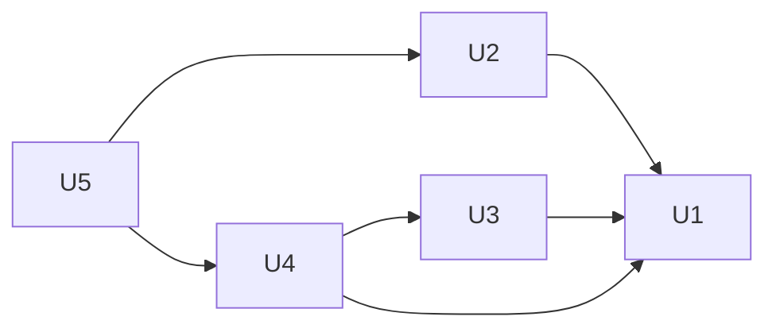

# Unidades de trabajo

> Descomposición del sistema en unidades construibles y probables de forma
> independiente. El bloque JSON al final es la fuente que usa el workflow
> para ordenar la construcción: mantenlo sincronizado con las tablas.

Cinco unidades que aportan a un único APK. La primera es el esqueleto
funcional exigido por la forma de trabajo y por la condición 1 de
factibilidad; las demás completan cada funcionalidad sobre él. Cada unidad se
construye en su propia rama y se une a `main` con un pull request.

## Resumen

| ID | Directorio | Nombre | Tipo | Complejidad | Depende de |
|---|---|---|---|---|---|
| U1 | u1-walking-skeleton | Esqueleto funcional | service | L | — |
| U2 | u2-extraction | Enlaces y extracción | library | L | U1 |
| U3 | u3-conversion | Conversión a sticker | library | M | U1 |
| U4 | u4-packs-whatsapp | Paquetes y WhatsApp | library | L | U1, U3 |
| U5 | u5-user-interface | Interfaz completa | ui | M | U2, U4 |

`library` aquí significa: código dentro del mismo APK, sin ejecutable propio.

## Detalle por unidad

### U1 — Esqueleto funcional
- **Responsabilidad:** crear el proyecto (Gradle, módulos `core` y `app`,
  catálogo de versiones, ktlint, detekt, README con la advertencia sobre
  TikTok, `.gitignore` que excluye claves) y una rebanada mínima que recorra
  todo el sistema: un enlace fijo → el WebView oculto obtiene la primera
  imagen de los comentarios → se convierte a sticker estático → se guarda en
  un paquete de 3 → se agrega a WhatsApp.
- **Componentes incluidos:** versiones mínimas de CMP-02, CMP-03, CMP-04,
  CMP-05, CMP-06, CMP-07, CMP-08, CMP-10 y CMP-11, con los puertos ya en su
  forma definitiva.
- **Historias:** ninguna completa; prueba la viabilidad de US2.1, US3.1,
  US4.1 y US4.2.
- **Despliegue:** compartido (APK único).
- **Notas de implementación:**
  - Debe responder, medido en el teléfono: si la extracción funciona sin
    sesión (RSK-01) y con el bloqueo de dominios (NFR6); si WhatsApp relee un
    paquete al cambiar su versión (FR5.6); tiempos de conversión (NFR2).
  - Si la extracción no funciona, la construcción se detiene y la persona
    decide la vía alternativa (condición 2 de factibilidad).
  - Para llegar al mínimo de 3 stickers puede repetir la misma imagen.

### U2 — Enlaces y extracción
- **Responsabilidad:** reconocer enlaces y extraer de forma completa y robusta
  las imágenes de los comentarios, con todos sus errores.
- **Componentes incluidos:** CMP-01, CMP-02, CMP-03.
- **Historias:** US1.3, US2.1, US2.3 (lógica); errores de US5.1.
- **Despliegue:** compartido.
- **Notas de implementación:** `CommentResponseParser` se prueba con
  respuestas reales guardadas como ejemplos; la extracción contra TikTok real
  se comprueba a mano. Política de carga inicial y tiempo límite con reloj
  simulado.

### U3 — Conversión a sticker
- **Responsabilidad:** convertir cualquier imagen (remota o de la galería) a
  sticker válido, estático o animado, con la caída a estático.
- **Componentes incluidos:** CMP-04, CMP-05.
- **Historias:** US3.1, US3.2.
- **Despliegue:** compartido.
- **Notas de implementación:** las reglas BR-06 a BR-10 se prueban primero en
  `core` con un codificador falso que devuelve tamaños controlados. Medir
  NFR2 con animaciones reales.

### U4 — Paquetes y WhatsApp
- **Responsabilidad:** reglas completas de paquetes, almacenamiento atómico,
  integración con WhatsApp y el caso de uso de guardado.
- **Componentes incluidos:** CMP-06, CMP-07, CMP-08, CMP-09.
- **Historias:** US3.3, US4.1, US4.2, US4.3, US4.5 (lógica).
- **Despliegue:** compartido.
- **Notas de implementación:** BR-11 a BR-22 en `core` con repositorio y
  publicador falsos. El reparto al llenarse (BR-14) y la atomicidad (BR-21)
  son los casos más delicados.

### U5 — Interfaz completa
- **Responsabilidad:** las cuatro pantallas con su estado, recepción desde
  Compartir, pegar enlace, cuadrícula y selección, cargar más, resultado,
  lista de paquetes, mensajes de error, importación desde la galería.
- **Componentes incluidos:** CMP-10 (completa).
- **Historias:** US1.1, US1.2, US2.2, US2.4, US4.4, US5.1 (presentación),
  US5.2.
- **Despliegue:** compartido.
- **Notas de implementación:** pruebas de los ViewModels con puertos falsos;
  la apariencia se comprueba con la lista manual. Cierra el criterio de
  salida con los 5 videos reales.

## Dependencias



En texto: U2, U3 y U4 se apoyan en el proyecto y los puertos creados por U1.
U4 necesita el conversor de U3 para su caso de uso de guardado. U5 necesita
la extracción completa (U2) y el guardado con paquetes (U4).

**Puntos de integración:** todos son llamadas dentro del mismo proceso a
través de los puertos de `interfaces.md`. No hay datos compartidos entre
unidades salvo el índice de paquetes, que solo toca U4. Los puertos se
definen en U1; si una unidad posterior necesita cambiar un puerto, lo hace en
su propio pull request y ajusta los usos existentes.

## Definición para el workflow

```json
{
  "units": [
    { "id": "u1-walking-skeleton", "name": "U1 — Esqueleto funcional", "kind": "service", "depends_on": [] },
    { "id": "u2-extraction", "name": "U2 — Enlaces y extracción", "kind": "library", "depends_on": ["u1-walking-skeleton"] },
    { "id": "u3-conversion", "name": "U3 — Conversión a sticker", "kind": "library", "depends_on": ["u1-walking-skeleton"] },
    { "id": "u4-packs-whatsapp", "name": "U4 — Paquetes y WhatsApp", "kind": "library", "depends_on": ["u1-walking-skeleton", "u3-conversion"] },
    { "id": "u5-user-interface", "name": "U5 — Interfaz completa", "kind": "ui", "depends_on": ["u2-extraction", "u4-packs-whatsapp"] }
  ]
}
```
